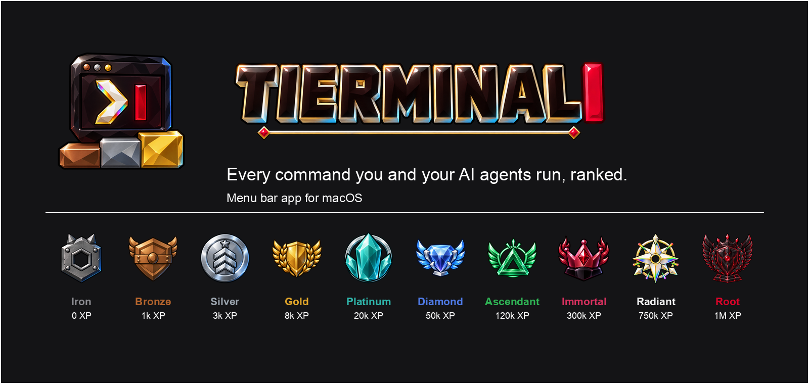

<p align="center"></p>

Menu bar app for macOS that ranks every shell command you and your AI agents run. Ten tiers from Iron to
Root, XP from commands, ssh time and monitoring time, a rank reveal, share cards.

## Install

Download `Tierminal-<version>.zip` from Releases, unzip, move to Applications, open. The build is not
notarized: right-click, Open on first launch. The setup wizard installs the hooks and imports your history.

From source, with the Xcode command line tools:

```bash
./install.sh
```

## What is counted

- Every interactive zsh or bash command, with timing and exit code.
- Every command an AI agent runs through a shell. Claude Code has exact hooks; everything else is matched by its
  process tree against a registry of about 55 agents, with provider and model attribution. See [AGENTS.md](AGENTS.md).
- History: zsh, Amazon Q, Claude Code transcripts, Codex rollouts, re-read for new entries every 90 seconds.
- Other machines over ssh: `tierminal.py remote add <host>`.

Only command text, timing and the names of agent env vars are recorded. Nothing leaves the machine.

## Ranks

| Tier | XP | | Tier | XP |
|------|----|-|------|----|
| Iron | 0 | | Diamond | 50,000 |
| Bronze | 1,000 | | Ascendant | 120,000 |
| Silver | 3,000 | | Immortal | 300,000 |
| Gold | 8,000 | | Radiant | 750,000 |
| Platinum | 20,000 | | Root | 1,000,000 |

Three divisions per tier, Root has none. Drop your own art into `~/Library/Application Support/Tierminal/emblems/`
as `gold-3.png`, `root.png` and so on to replace the bundled set.

MIT license.
